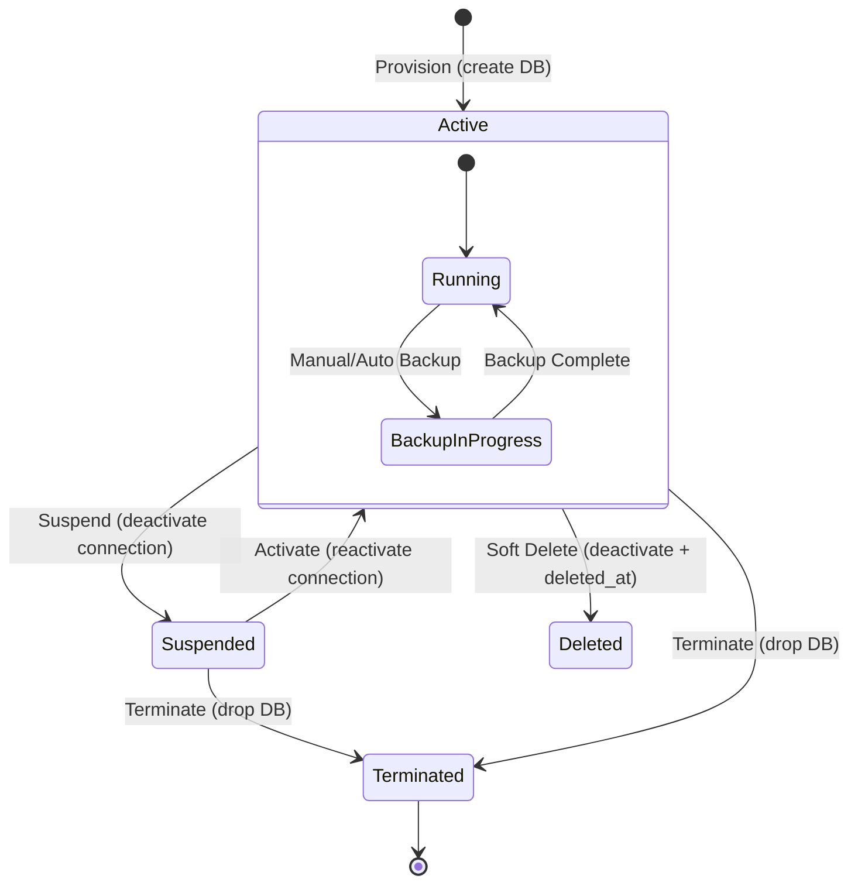
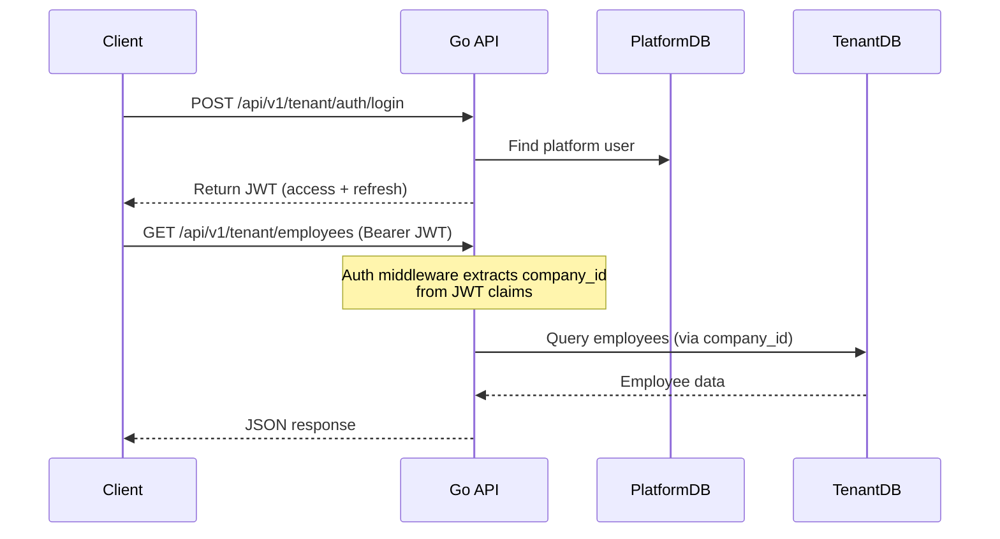
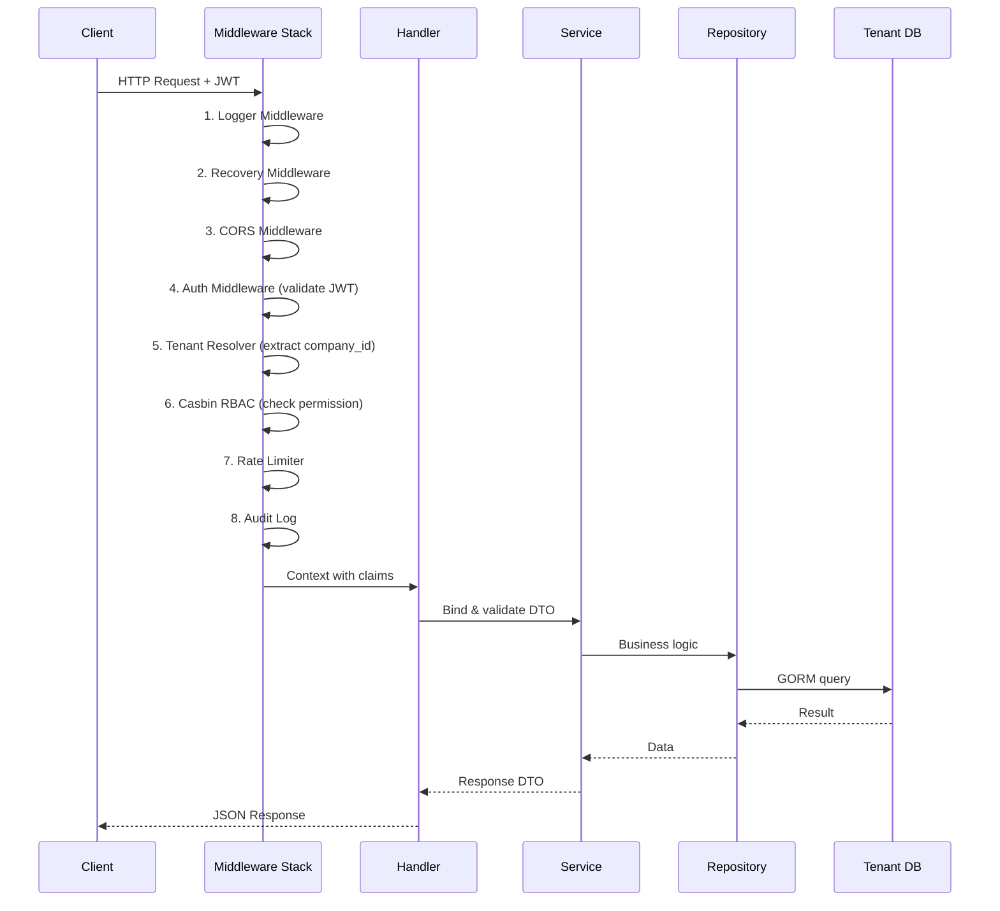
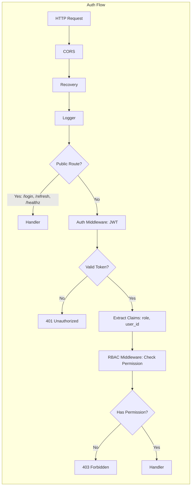
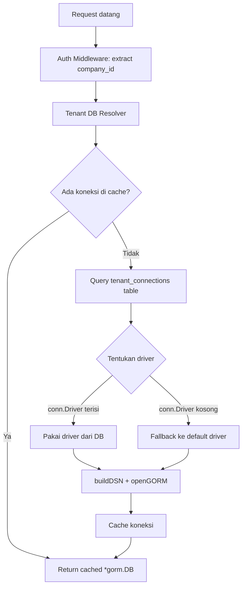
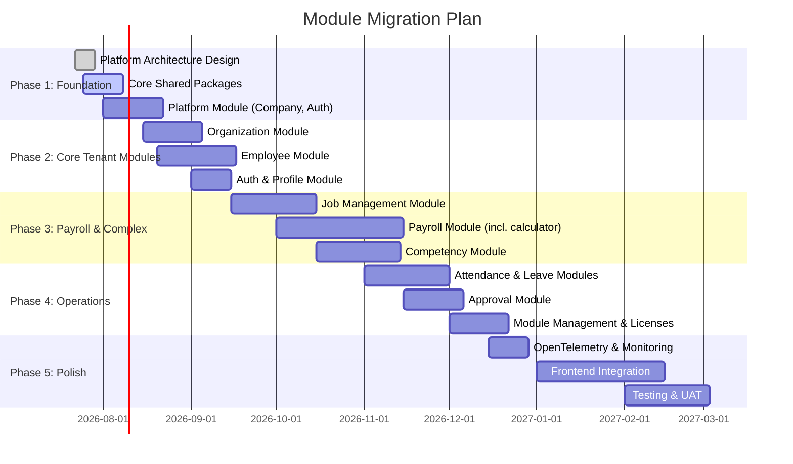

# Platform Architecture Design — HRIS Go Modular Monolith

**Dokumen:** Architecture Design Document (Step 3 - Blueprint Roadmap)
**Tanggal:** 22 Juli 2026
**Versi:** 1.6
**Status:** ✅ Scaffolding Selesai + Multi-Database Driver Support + MySQL UUID Compatibility + RBAC Authorization + SQL Migration Runner (Up/Down Rollback) + Tenant Provisioning End-to-End (MySQL) Verified + Employee Module ✅

---

## Daftar Isi

1. [Overview Arsitektur](#1-overview-arsitektur)
2. [Monorepo Structure](#2-monorepo-structure)
3. [Modular Monolith Pattern](#3-modular-monolith-pattern)
4. [Multi-Tenant Architecture](#4-multi-tenant-architecture)
5. [Tenant Provisioning Engine](#5-tenant-provisioning-engine)
6. [Platform Management Design](#6-platform-management-design)
7. [Module SDK Design](#7-module-sdk-design)
8. [API Design](#8-api-design)
9. [Data Flow](#9-data-flow)
10. [Security Architecture](#10-security-architecture)
11. [Infrastructure & Deployment](#11-infrastructure--deployment)
12. [Multi-Database Driver Support](#13-multi-database-driver-support)
    12.1. [MySQL UUID Compatibility](#139-mysql-uuid-compatibility)
13. [Module Migration Plan](#14-module-migration-plan)

---

## 1. Overview Arsitektur

### 1.1 High-Level Architecture

```mermaid
graph TB
    subgraph "Clients"
        A[Web App - Vue 3]
        B[Mobile App - Future]
    end

    subgraph "API Gateway / Load Balancer"
        C[NGINX / Traefik]
    end

    subgraph "Go Modular Monolith"
        D[Gin HTTP Server]
        
        subgraph "Platform Module"
            P1[Company Management]
            P2[Module Management]
            P3[License Management]
            P4[Platform Users]
            P5[Feature Flag]
            P6[Tenant Monitoring]
        end

        subgraph "Tenant Modules"
            T1[Organization]
            T2[Employee]
            T3[Attendance]
            T4[Leave]
            T5[Payroll]
            T6[Competency]
            T7[Job Management]
            T8[Approval]
            T9[Recruitment - Future]
            T10[Performance - Future]
        end

        subgraph "Shared Kernel"
            S1[Multi-Tenant DB Manager]
            S2[JWT Auth]
            S3[Casbin RBAC]
            S4[Audit Log]
            S5[Config Manager]
            S6[Logger - Zap]
            S7[Validator]
            S8[OpenTelemetry]
        end
    end

    subgraph "Infrastructure"
        DB1[(Platform DB - PostgreSQL)]
        DB2[(Tenant DB 1 - PostgreSQL)]
        DB3[(Tenant DB N - PostgreSQL)]
        R[(Redis - Cache + Asynq)]
        O[OpenTelemetry Collector]
    end

    A --> C --> D
    D --> P1 --> DB1
    D --> P2 --> DB1
    D --> P3 --> DB1
    D --> T1 --> DB2
    D --> T1 --> DB3
    D --> T2 --> DB2
    D --> S1 --> DB2
    D --> S1 --> DB3
    D --> R
    D --> O
```



### 1.2 Design Principles

| Prinsip | Deskripsi |
|---|---|
| **Modular Monolith** | Satu binary Go, multiple internal modules dengan batasan tegas |
| **Database per Tenant** | Isolasi data total antar company/tenant |
| **Module SDK** | Setiap modul mengikuti kontrak manifest.yaml yang sama |
| **Domain-Driven** | Setiap modul memiliki bounded context sendiri |
| **API-First** | REST API dengan dokumentasi OpenAPI 3.0 |
| **Observability by Default** | Tracing, metrics, logging via OpenTelemetry |
| **Security by Design** | JWT + Casbin RBAC + Audit Log + Rate Limiting |

### 1.3 Technology Stack

| Layer | Teknologi | Justifikasi |
|---|---|---|
| **Language** | Go 1.22+ | Performa, concurrency, deploy mudah (single binary) |
| **HTTP Framework** | Gin | Mature, high performance, large ecosystem |
| **ORM** | GORM (postgres + mysql drivers) | Most popular Go ORM, support PostgreSQL & MySQL |
| **Database** | PostgreSQL / MySQL | Dual-driver support via config (`database.driver`) |
| **Cache** | Redis | Session cache, rate limiting, queue |
| **Queue** | Asynq | Redis-based, delay/scheduler, monitoring UI |
| **Auth** | JWT (golang-jwt) | Stateless, multi-tenant compatible |
| **RBAC** | Custom authz engine | Resource-action based permission checking dengan role hierarchy |
| **Validation** | go-playground/validator | Struct tag-based, kaya fitur |
| **Logging** | Zap | High performance structured logging |
| **Tracing** | OpenTelemetry | Standard observability |
| **Config** | Viper | Multi-source config (file/env/remote) |

---

## 2. Monorepo Structure

### 2.1 Directory Tree

```text
hris-platform/                          # Root monorepo
├── backend/                            # Go backend
│   ├── cmd/
│   │   ├── server/
│   │   │   └── main.go                 # Entry point API server
│   │   └── installer/
│   │       └── main.go                 # CLI installer (tenant provisioning)
│   ├── internal/
│   │   ├── platform/                   # Platform Management Module
│   │   │   ├── company/
│   │   │   │   ├── handler.go
│   │   │   │   ├── service.go
│   │   │   │   ├── repository.go
│   │   │   │   ├── model.go
│   │   │   │   ├── dto.go
│   │   │   │   └── routes.go
│   │   │   ├── module/
│   │   │   │   ├── handler.go
│   │   │   │   ├── service.go
│   │   │   │   ├── repository.go
│   │   │   │   ├── model.go
│   │   │   │   └── dto.go
│   │   │   ├── license/
│   │   │   │   └── ...
│   │   │   └── user/
│   │   │       └── ...
│   │   ├── modules/                    # Tenant Modules
│   │   │   ├── organization/
│   │   │   │   ├── handler.go
│   │   │   │   ├── service.go
│   │   │   │   ├── repository.go
│   │   │   │   ├── model.go
│   │   │   │   └── dto.go
│   │   │   ├── employee/
│   │   │   │   ├── handler.go
│   │   │   │   ├── service.go
│   │   │   │   ├── repository.go
│   │   │   │   ├── model.go
│   │   │   │   └── dto.go
│   │   │   ├── attendance/
│   │   │   │   └── ...
│   │   │   ├── leave/
│   │   │   │   └── ...
│   │   │   ├── payroll/
│   │   │   │   ├── handler.go
│   │   │   │   ├── service.go
│   │   │   │   ├── repository.go
│   │   │   │   ├── model.go
│   │   │   │   ├── dto.go
│   │   │   │   ├── calculator/        # Perhitungan payroll (pindahan dari SP)
│   │   │   │   └── pph21/             # Perhitungan PPh21
│   │   │   ├── competency/
│   │   │   │   └── ...
│   │   │   ├── jobmanagement/
│   │   │   │   └── ...
│   │   │   └── approval/
│   │   │       └── ...
│   │   └── pkg/                        # Shared Kernel (wajib semua modul)
│   │       ├── config/                 # Viper configuration
│   │       ├── database/               # Multi-tenant DB connection manager
│   │       ├── driver/                 # Shared DB driver type (postgres | mysql)
│   │       ├── auth/                   # JWT generation & validation
│   │       ├── authz/                  # RBAC authorization (role-based permission)
│   │       ├── middleware/             # Gin middleware (auth, tenant, audit, RBAC)
│   │       ├── router/                 # Router setup & module registration
│   │       ├── tenant/                 # Tenant context resolver
│   │       ├── logger/                 # Zap logger setup
│   │       ├── telemetry/              # OpenTelemetry setup
│   │       ├── validator/              # Custom validators
│   │       ├── module/                 # Module SDK interfaces
│   │       └── errors/                 # Standard error types
│   ├── config/
│   │   ├── config.yaml                 # Base config
│   │   └── config.example.yaml
│   └── internal/
│       └── pkg/
│           └── migrator/               # SQL Migration Engine (embedded .sql files)
│               ├── migrator.go         # Core: Up(), Down(), DownTo()
│               ├── embed.go            # //go:embed migrations/
│               └── migrations/
│                   ├── platform/       # Platform DDL (6 files)
│                   ├── seeders/        # Seed data (1 file)
│                   └── tenant/         # Tenant template (empty)
│   ├── docker/
│   │   ├── Dockerfile
│   │   └── docker-compose.yml
│   ├── go.mod
│   ├── go.sum
│   └── Makefile
├── frontend/                           # Vue 3 + TypeScript (future)
│   ├── platform-admin/                 # Admin panel (multi-company)
│   ├── tenant/                         # Tenant app per company
│   └── shared/                         # Shared components & composables
├── docs/                               # Documentation
│   ├── api/                            # OpenAPI specs
│   └── guides/                         # Developer guides
├── docker/
│   └── docker-compose.yml              # Full infra compose
└── README.md
```

### 2.2 Key Design Decisions

| Decision | Rationale |
|---|---|
| **Single binary + CLI installer** | `cmd/server` = API server, `cmd/installer` = CLI untuk provisioning tenant |
| **`internal/` vs `pkg/`** | `internal/` = private code, `pkg/` = public library (jika ada) |
| **Module self-contained** | Setiap module punya handler, service, repository, model sendiri |
| **Shared kernel di `internal/pkg/`** | Infrastruktur bersama yang dipakai semua modul |
| **Tenant modules dipisah dari platform** | Isolasi logika platform vs tenant bisnis |
| **Multi-database driver** | Shared `internal/pkg/driver` package untuk PostgreSQL & MySQL |

---

## 3. Modular Monolith Pattern

### 3.1 Module Contract (Module SDK Interface)

Setiap modul harus mengimplementasikan interface berikut:

```go
// internal/pkg/module/module.go

package module

import (
    "github.com/gin-gonic/gin"
    "github.com/redis/go-redis/v9"
    "gorm.io/gorm"
)

// ModuleInfo berisi metadata modul
type ModuleInfo struct {
    Name        string   `yaml:"name"`
    Slug        string   `yaml:"slug"`
    Version     string   `yaml:"version"`
    Description string   `yaml:"description"`
    DependsOn   []string `yaml:"depends_on"`
    Permissions []string `yaml:"permissions"`
    Menus       []Menu   `yaml:"menus"`
}

type Menu struct {
    Name   string `yaml:"name"`
    Icon   string `yaml:"icon"`
    Route  string `yaml:"route"`
    Parent string `yaml:"parent,omitempty"`
}

// Module adalah interface yang wajib diimplementasi setiap modul
type Module interface {
    // Info mengembalikan metadata modul
    Info() ModuleInfo

    // RegisterRoutes mendaftarkan semua endpoint modul ke router
    RegisterRoutes(router *gin.RouterGroup)

    // Migrate menjalankan migration database untuk modul ini
    Migrate(db *gorm.DB) error

    // Seed menjalankan seeder data awal
    Seed(db *gorm.DB) error

    // Permissions mengembalikan daftar permission yang dibutuhkan modul
    Permissions() []string
}
```

### 3.2 Module Registration

```go
// cmd/server/main.go

package main

import (
    "hris-platform/internal/modules/employee"
    "hris-platform/internal/modules/organization"
    "hris-platform/internal/pkg/module"
    "hris-platform/internal/platform/company"
)

func main() {
    // Setup shared infrastructure
    cfg := config.Load()
    logger := logger.New(cfg)
    dbManager := database.NewManager(cfg)
    authMiddleware := auth.NewMiddleware(cfg)

    // Register all modules
    modules := []module.Module{
        company.NewModule(dbManager),
        organization.NewModule(dbManager),
        employee.NewModule(dbManager),
        // ... more modules
    }

    // Setup router with middleware
    r := router.Setup(cfg, authMiddleware, modules)
    r.Run(cfg.ServerPort)
}
```

### 3.3 Dependency Injection Pattern

```go
// Setiap module menggunakan constructor injection

type EmployeeModule struct {
    dbManager *database.Manager
    validator *validator.CustomValidator
    logger    *zap.Logger
}

func NewEmployeeModule(dbManager *database.Manager) *EmployeeModule {
    return &EmployeeModule{
        dbManager: dbManager,
        validator: validator.New(),
        logger:    logger.New("employee"),
    }
}
```

### 3.4 Layer Pattern dalam Setiap Modul

```text
HTTP Request
    ↓
Handler (routes/handler.go)
    ├── Parse request -> DTO
    ├── Validate (via validator)
    └── Call Service
            ↓
        Service (service.go)
            ├── Business logic
            ├── Orchestrate multiple repositories
            ├── Transaction management
            └── Event publishing
                    ↓
                Repository (repository.go)
                    ├── Database operations via GORM
                    └── Data access via Tenant DB
                            ↓
                        GORM -> Tenant Database
```

---

## 4. Multi-Tenant Architecture

### 4.1 Database Topology

```text
┌─────────────────────────────────────────────────────┐
│                  PostgreSQL Server                    │
│                                                       │
│  ┌──────────────┐  ┌──────────────┐  ┌──────────────┐ │
│  │  Platform DB  │  │  Tenant 1 DB │  │  Tenant 2 DB │ │
│  │  (hris_plat)  │  │  (hris_t_1)  │  │  (hris_t_2)  │ │
│  ├──────────────┤  ├──────────────┤  ├──────────────┤ │
│  │ companies     │  │ organizations│  │ organizations│ │
│  │ modules       │  │ employees    │  │ employees    │ │
│  │ licenses      │  │ attendances  │  │ attendances  │ │
│  │ feature_flags │  │ leaves       │  │ leaves       │ │
│  │ platform_users│  │ payrolls     │  │ payrolls     │ │
│  │ audit_logs    │  │ ...          │  │ ...          │ │
│  └──────────────┘  └──────────────┘  └──────────────┘ │
└─────────────────────────────────────────────────────┘
```

### 4.2 Migration Tooling

**Runtime:** Go SQL Migration Runner (`internal/pkg/migrator/`)

| Tool | Fungsi |
|---|---|
| **SQL Migrator** (`migrator.Up()`) | Eksekusi file `.sql` yang di-embed ke binary — untuk schema DDL dan seed data |
| **GORM AutoMigrate** (`m.Migrate()`) | Sinkronisasi model Go struct ke tabel database — untuk development & column sync |
| **Down Rollback** (`migrator.Down()` / `migrator.DownTo()`) | Rollback migration via file `.down.sql` — reverse operation DDL/DML |

**Migration Strategy:**
- Platform DB migrations: `internal/pkg/migrator/migrations/platform/` (6 files)
- Seed data: `internal/pkg/migrator/migrations/seeders/` (1 file)
- Tenant DB template migrations: `internal/pkg/migrator/migrations/tenant/` (future)
- Eksekusi di startup: [SQL Migrator → AutoMigrate → SQL Seeders → Module Seeders]

**File Convention:**
```text
001_create_companies.sql        ← Up migration (DDL)
001_create_companies.down.sql    ← Down migration (reverse DDL) — optional

002_create_tenant_connections.sql
002_create_tenant_connections.down.sql

...

001_seed_super_admin.sql        ← Seeder (DML)
001_seed_super_admin.down.sql    ← Reverse seeder — optional
```

**CLI Usage:**
```bash
# Normal startup (Up migrations + AutoMigrate + Seeders)
go run ./cmd/server --config config/config.yaml

# Rollback ALL applied migrations (down files required)
go run ./cmd/server --config config/config.yaml --migrate-down

# Rollback to specific version (exclusive: versions > 004 get rolled back)
go run ./cmd/server --config config/config.yaml --migrate-to 004
```

**Startup Migration Flow:**
```text
[1] SQL Migrator (platform/*.sql) → CREATE TABLE IF NOT EXISTS, indexes, FKs
[2] GORM AutoMigrate              → Sync Go struct columns to existing tables
[3] SQL Seeders (seeders/*.sql)   → INSERT initial data (super admin, etc.)
[4] Module Seeders                → Business logic seed data
```

### 4.3 Platform Database Schema

```sql
-- Tabel platform yang shared untuk semua tenant

CREATE TABLE companies (
    id          CHAR(36) PRIMARY KEY,
    name        VARCHAR(255) NOT NULL,
    slug        VARCHAR(100) UNIQUE NOT NULL,
    npwp        VARCHAR(16),
    nib         VARCHAR(25),
    address     TEXT,
    email       VARCHAR(255),
    phone       VARCHAR(20),
    status      VARCHAR(20) DEFAULT 'active',  -- active, suspended, terminated
    db_name     VARCHAR(100),                    -- nama database tenant
    db_host     VARCHAR(255) DEFAULT 'localhost',
    db_port     INTEGER DEFAULT 5432,
    db_user     VARCHAR(100),
    db_password VARCHAR(255),
    created_at  TIMESTAMP DEFAULT NOW(),
    updated_at  TIMESTAMP DEFAULT NOW(),
    deleted_at  TIMESTAMP
);

CREATE TABLE modules (
    id          CHAR(36) PRIMARY KEY,
    name        VARCHAR(255) NOT NULL,
    slug        VARCHAR(100) UNIQUE NOT NULL,
    version     VARCHAR(20) NOT NULL,
    description TEXT,
    depends_on  TEXT DEFAULT '',               -- Comma-separated module slugs
    is_core     BOOLEAN DEFAULT FALSE,
    enabled     BOOLEAN DEFAULT TRUE,
    created_at  TIMESTAMP DEFAULT NOW()
);

CREATE TABLE company_modules (
    company_id  CHAR(36) REFERENCES companies(id),
    module_id   CHAR(36) REFERENCES modules(id),
    enabled     BOOLEAN DEFAULT TRUE,
    config      JSON DEFAULT '{}',
    activated_at TIMESTAMP,
    PRIMARY KEY (company_id, module_id)
);

CREATE TABLE licenses (
    id              CHAR(36) PRIMARY KEY,
    company_id      CHAR(36) REFERENCES companies(id),
    license_key     VARCHAR(100) UNIQUE NOT NULL,
    plan_type       VARCHAR(50) NOT NULL,      -- free, basic, pro, enterprise
    max_employees   INTEGER DEFAULT 0,
    max_modules     INTEGER DEFAULT 0,
    start_date      DATE NOT NULL,
    end_date        DATE NOT NULL,
    status          VARCHAR(20) DEFAULT 'active',
    created_at      TIMESTAMP DEFAULT NOW()
);

CREATE TABLE platform_users (
    id              CHAR(36) PRIMARY KEY,
    company_id      CHAR(36) REFERENCES companies(id),
    email           VARCHAR(255) UNIQUE NOT NULL,
    password_hash   VARCHAR(255) NOT NULL,
    name            VARCHAR(255),
    role            VARCHAR(50) DEFAULT 'admin',  -- super_admin, company_admin
    is_active       BOOLEAN DEFAULT TRUE,
    last_login_at   TIMESTAMP,
    created_at      TIMESTAMP DEFAULT NOW()
);

CREATE TABLE feature_flags_runtime (
    -- Runtime cache untuk feature flag evaluation
    -- Di-cache di Redis dengan key: feature_flag:{company_id}:{flag_key}
    -- Flag bisa diubah via API tanpa restart server
);

CREATE TABLE feature_flags (
    id          CHAR(36) PRIMARY KEY,
    module_id   CHAR(36) REFERENCES modules(id),
    company_id  CHAR(36) REFERENCES companies(id),
    flag_key    VARCHAR(100) NOT NULL,
    flag_value  JSON NOT NULL DEFAULT 'true',
    UNIQUE (module_id, company_id, flag_key)
);

CREATE TABLE audit_logs (
    id          CHAR(36) PRIMARY KEY,
    company_id  CHAR(36) REFERENCES companies(id),
    user_id     CHAR(36),
    action      VARCHAR(100) NOT NULL,  -- create, update, delete, login, etc
    resource    VARCHAR(100) NOT NULL,  -- employee, organization, etc
    resource_id CHAR(36),
    details     JSON DEFAULT '{}',
    ip_address  VARCHAR(45),
    user_agent  TEXT,
    created_at  TIMESTAMP DEFAULT NOW()
);

CREATE TABLE tenant_connections (
    id          CHAR(36) PRIMARY KEY,
    company_id  CHAR(36) UNIQUE REFERENCES companies(id),
    driver      VARCHAR(20) DEFAULT 'postgres',  -- postgres | mysql
    host        VARCHAR(255) NOT NULL,
    port        INTEGER NOT NULL DEFAULT 5432,
    db_name     VARCHAR(100) NOT NULL,
    username    VARCHAR(100) NOT NULL,
    password    VARCHAR(255) NOT NULL,  -- TODO: encrypt at rest
    ssl_mode    VARCHAR(20) DEFAULT 'require',
    is_active   BOOLEAN DEFAULT TRUE,
    created_at  TIMESTAMP DEFAULT NOW(),
    updated_at  TIMESTAMP DEFAULT NOW()
);
```

### 4.4 Tenant Database Schema (Template)

Setiap tenant database memiliki struktur yang identik. Berikut daftar lengkap **106 tabel tenant** (diverifikasi dari provisioning end-to-end test):

**Approval (5):**
- `approval_actions`, `approval_flow_steps`, `approval_flows`, `approval_instances`, `approval_tasks`

**Attendance (10):**
- `attendance_company_settings`, `attendance_company_shifts`, `attendance_device_captures`
- `attendance_employee_shifts`, `attendance_events`, `attendance_exempt_positions`
- `attendance_face_captures`, `attendance_locations`, `attendance_overtime_requests`, `attendance_sessions`

**BPJS (2):**
- `bpjs_rate_components`, `bpjs_settings`

**Competency (7):**
- `competence_values`, `competencies`, `competency_event_targets`, `competency_events`
- `competency_score_details`, `competency_scores`, `competency_values`

**Employee (14):**
- `emergency_contacts`, `employee_addresses`, `employee_bank_profiles`, `employee_bpjs_profiles`
- `employee_documents`, `employee_educations`, `employee_experiences`, `employee_families`
- `employee_insurances`, `employee_leave_balances`, `employee_payroll_profiles`, `employee_tax_profiles`
- `employees`, `employments`

**Job Management (20):**
- `job_families`, `job_family_competencies`
- `job_management_assets`, `job_management_competency_groups`, `job_management_education_experiences`
- `job_management_financials`, `job_management_hr_authorities`, `job_management_identifications`
- `job_management_objectives`, `job_management_operational_authorities`, `job_management_potency_competencies`
- `job_management_relationships`, `job_management_responsibilities`, `job_management_scores`
- `job_management_subordinate_controls`, `job_management_title_subs`, `job_management_titles`
- `job_management_values`, `job_management_working_activities`, `job_management_working_risks`

**Leave (5):**
- `leave_accrual_policies`, `leave_reasons`, `leave_request_details`, `leave_requests`, `leave_types`

**Master Data (12):**
- `countries`, `districts`, `document_templates`, `educations`, `employment_statuses`
- `gradings`, `marital_statuses`, `provinces`, `regencies`, `relationship_types`, `religions`
- `villages`

**Organization (5):**
- `organization_levels`, `organization_summaries`, `organizations`
- `positions`, `zones`

**Payroll (16):**
- `payroll_payslips`, `payroll_periods`, `payroll_profile_change_logs`, `payroll_run_employees`
- `payroll_run_items`, `payroll_runs`, `pph21_calculation_logs`, `pph21_ptkp_rates`
- `pph21_settings`, `pph21_tax_brackets`, `ptkps`, `salary_change_logs`
- `salary_components`, `salary_employee_adjustments`, `salary_employee_components`, `salary_grade_components`

**Settings & Permissions (7):**
- `feature_permission`, `features`, `model_has_permissions`, `model_has_roles`
- `permissions`, `role_has_permissions`, `roles`

**Leave (6):**
- `company_holidays`, `leave_accrual_policies`, `leave_reasons`, `leave_request_details`, `leave_requests`, `leave_types`

**System/Migrator (1):**
- `schema_migrations`

**Tax (1):**
- `ters`

### 4.8 Example Tenant Tables

Setiap tenant database memiliki struktur yang identik:

```sql
-- Semua tabel bisnis tanpa company_id (karena sudah terisolasi per DB)

CREATE TABLE organizations (
    id              CHAR(36) PRIMARY KEY,
    code            VARCHAR(10) NOT NULL,
    full_code       VARCHAR(50) NOT NULL,
    nomenclature    VARCHAR(255) NOT NULL,
    parent_id       CHAR(36) REFERENCES organizations(id),
    zone_id         CHAR(36) REFERENCES zones(id),
    job_family_id   CHAR(36) REFERENCES job_families(id),
    grading_id      CHAR(36) REFERENCES gradings(id),
    level           INTEGER DEFAULT 0,
    sort_order      INTEGER DEFAULT 0,
    created_by      CHAR(36),
    updated_by      CHAR(36),
    created_at      TIMESTAMP DEFAULT NOW(),
    updated_at      TIMESTAMP DEFAULT NOW(),
    deleted_at      TIMESTAMP
);

CREATE TABLE employees (
    id              CHAR(36) PRIMARY KEY,
    employee_id     VARCHAR(20) UNIQUE NOT NULL,
    nik             VARCHAR(16),
    name            VARCHAR(255) NOT NULL,
    gender          VARCHAR(10),
    pob             VARCHAR(100),
    dob             DATE,
    phone_number    VARCHAR(20),
    email           VARCHAR(255),
    religion_id     CHAR(36) REFERENCES religions(id),
    marital_status_id CHAR(36) REFERENCES marital_statuses(id),
    npwp            VARCHAR(16),
    ptkp            VARCHAR(10),
    status          VARCHAR(20) DEFAULT 'active',
    created_by      CHAR(36),
    updated_by      CHAR(36),
    created_at      TIMESTAMP DEFAULT NOW(),
    updated_at      TIMESTAMP DEFAULT NOW(),
    deleted_at      TIMESTAMP
);

-- ... dan seterusnya untuk semua tabel tenant
```

### 4.9 Feature Flag Runtime

Feature flags di-cache di Redis dengan struktur:

```go
// Key pattern: feature_flag:{company_id}:{flag_key}
// Value: JSON boolean or object

// Cache-first strategy:
func (s *FeatureFlagService) IsEnabled(ctx context.Context, companyID, flagKey string) bool {
    cacheKey := fmt.Sprintf("feature_flag:%s:%s", companyID, flagKey)
    
    // 1. Check Redis cache
    val, err := s.redis.Get(ctx, cacheKey).Result()
    if err == nil {
        return val == "true"
    }
    
    // 2. Fallback to database
    var flag FeatureFlag
    if err := s.db.Where("company_id = ? AND flag_key = ?", companyID, flagKey).First(&flag).Error; err != nil {
        return false  // Default disabled
    }
    
    // 3. Cache for 5 minutes
    flagValue := fmt.Sprintf("%v", flag.FlagValue)
    s.redis.Set(ctx, cacheKey, flagValue, 5*time.Minute)
    
    return flag.FlagValue == true
}

// Invalidate cache when flag changes:
func (s *FeatureFlagService) SetFlag(ctx context.Context, companyID, flagKey string, value bool) error {
    cacheKey := fmt.Sprintf("feature_flag:%s:%s", companyID, flagKey)
    s.redis.Del(ctx, cacheKey)  // Invalidate cache
    // Update database...
}
```

### 4.10 Multi-Tenant DB Connection Manager

```go
// internal/pkg/database/manager.go

package database

import (
    "fmt"
    "sync"
    "time"

    "gorm.io/gorm"
    "gorm.io/driver/postgres"
)

type Manager struct {
    platformDB *gorm.DB
    tenants    map[string]*gorm.DB  // company_id -> db connection
    mu         sync.RWMutex
    config     *Config
}

func NewManager(cfg *Config) *Manager {
    platformDB := connect(cfg.PlatformDSN())
    return &Manager{
        platformDB: platformDB,
        tenants:    make(map[string]*gorm.DB),
        config:     cfg,
    }
}

// PlatformDB mengembalikan koneksi ke platform database
func (m *Manager) PlatformDB() *gorm.DB {
    return m.platformDB
}

// TenantDB mengembalikan koneksi ke database tenant berdasarkan company_id
func (m *Manager) TenantDB(companyID string) (*gorm.DB, error) {
    m.mu.RLock()
    db, exists := m.tenants[companyID]
    m.mu.RUnlock()

    if exists {
        return db, nil
    }

    return m.connectTenant(companyID)
}

func (m *Manager) connectTenant(companyID string) (*gorm.DB, error) {
    m.mu.Lock()
    defer m.mu.Unlock()

    // Double-check after acquiring write lock
    if db, exists := m.tenants[companyID]; exists {
        return db, nil
    }

    // Get connection details from platform DB
    var conn TenantConnection
    if err := m.platformDB.Where("company_id = ?", companyID).First(&conn).Error; err != nil {
        return nil, fmt.Errorf("tenant connection not found: %w", err)
    }

    dsn := fmt.Sprintf(
        "host=%s port=%d user=%s password=%s dbname=%s sslmode=%s",
        conn.Host, conn.Port, conn.Username, conn.Password, conn.DBName, conn.SSLMode,
    )

    db, err := gorm.Open(postgres.Open(dsn), &gorm.Config{})
    if err != nil {
        return nil, fmt.Errorf("failed to connect tenant db: %w", err)
    }

    // Connection pool settings
    sqlDB, _ := db.DB()
    sqlDB.SetMaxIdleConns(10)
    sqlDB.SetMaxOpenConns(100)
    sqlDB.SetConnMaxLifetime(time.Hour)

    m.tenants[companyID] = db
    return db, nil
}

// ProvisionTenant membuat database tenant baru
func (m *Manager) ProvisionTenant(companyID, dbName, dbUser, dbPassword string) error {
    // 1. Create database
    // 2. Create database user
    // 3. Run migrations
    // 4. Run seeders
    // Implementation in Tenant Provisioning Engine section
    return nil
}
```

### 4.11 Tenant Context Middleware

```go
// internal/pkg/middleware/tenant.go

package middleware

import (
    "github.com/gin-gonic/gin"
)

// TenantResolver mengambil company_id dari JWT claims
// dan menyimpannya di context untuk dipakai oleh DB Manager
func TenantResolver() gin.HandlerFunc {
    return func(c *gin.Context) {
        // Company ID sudah ada di JWT claims (set by auth middleware)
        companyID := c.GetString("company_id")
        if companyID != "" {
            c.Set("tenant_id", companyID)
        }
        c.Next()
    }
}
```

---

## 5. Tenant Provisioning Engine

### 5.1 Flow Provisioning (Actual Implementation)

Provisioning dilakukan **secara synchronous** saat pembuatan company via API:

```text
POST /api/v1/platform/companies
    ↓
1. Generate slug dari company name
2. Cek duplikasi slug (tambahkan UUID suffix jika perlu)
3. Save company ke platform DB (status: active)
4. provisionTenant():
   ├── a. Generate db_name = hris_{slug}
   ├── b. Connect sebagai superuser (root@localhost)
   ├── c. Buat database tenant (CREATE DATABASE IF NOT EXISTS)
   ├── d. Simpan TenantConnection ke platform DB (ID = companyID)
   ├── e. Connect ke tenant DB via GORM
   └── f. Jalankan 11 tenant SQL migrations (106 tables)
5. Jika provisioning berhasil → company status: active
6. Jika provisioning gagal → company status: suspended (data tetap tersimpan)
```

### 5.2 Provisioning Code (Actual)

**Lokasi:** `backend/internal/platform/company/service.go`

```go
func (s *Service) Create(req CreateCompanyRequest) (*CompanyResponse, error) {
    companySlug := slug.Make(req.Name)

    if existing, _ := s.repo.FindBySlug(companySlug); existing != nil {
        companySlug = fmt.Sprintf("%s-%s", companySlug, uuid.New().String()[:8])
    }

    company := &Company{
        Name:   req.Name,
        Slug:   companySlug,
        Email:  req.Email,
        Phone:  req.Phone,
        Status: CompanyStatusActive,
    }

    if err := s.repo.Create(company); err != nil {
        return nil, err
    }

    // Tenant provisioning
    if err := s.provisionTenant(company); err != nil {
        company.Status = CompanyStatusSuspended
        _ = s.repo.Update(company)
    }

    return company.ToResponse(), nil
}

func (s *Service) provisionTenant(company *Company) error {
    dbName := fmt.Sprintf("hris_%s", company.Slug)

    conn, err := s.dbManager.ProvisionTenant(
        company.ID.String(), dbName,
        "root", "",  // development: superuser credentials
        s.dbManager.Driver(),
    )
    if err != nil {
        return fmt.Errorf("create tenant database: %w", err)
    }

    if err := s.dbManager.SaveTenantConnection(conn); err != nil {
        return fmt.Errorf("save tenant connection: %w", err)
    }

    tenantDB, err := s.dbManager.TenantDB(company.ID.String())
    if err != nil {
        return fmt.Errorf("connect tenant database: %w", err)
    }

    tenantMigrator := migrator.New(tenantDB, s.logger, migrator.MigrationsFS, migrator.RootTenant)
    if err := tenantMigrator.Up(); err != nil {
        return fmt.Errorf("tenant migration failed: %w", err)
    }

    return nil
}
```

### 5.3 Database Manager — Core Provisioning

**Lokasi:** `backend/internal/pkg/database/manager.go`

```go
// ProvisionTenant — Create tenant database via superuser connection
func (m *Manager) ProvisionTenant(companyID, dbName, dbUser, dbPassword, driverType string) (*TenantConnection, error) {
    // 1. Build superuser DSN (connect without specific database)
    var superDSN string
    switch driver.Parse(driverType) {
    case driver.MySQL:
        superDSN = fmt.Sprintf("%s:%s@tcp(%s:%d)/?charset=utf8mb4&parseTime=True&loc=Local",
            m.cfg.TenantSuperUser, m.cfg.TenantSuperPass,
            m.cfg.TenantHost, m.cfg.TenantPort,
        )
    default: // postgres
        superDSN = fmt.Sprintf(
            "host=%s port=%d user=%s password=%s dbname=postgres sslmode=%s",
            m.cfg.TenantHost, m.cfg.TenantPort,
            m.cfg.TenantSuperUser, m.cfg.TenantSuperPass, m.cfg.TenantSSLMode,
        )
    }

    superDB, _ := openGORM(driverType, superDSN, m.cfg.LogLevel)

    // 2. Create database
    switch driver.Parse(driverType) {
    case driver.MySQL:
        superDB.Exec(fmt.Sprintf(
            "CREATE DATABASE IF NOT EXISTS `%s` CHARACTER SET utf8mb4 COLLATE utf8mb4_unicode_ci",
            dbName,
        ))
    default:
        superDB.Exec(fmt.Sprintf("CREATE DATABASE \"%s\"", dbName))
    }

    // 3. Build & return TenantConnection
    return &TenantConnection{
        ID:        companyID,
        CompanyID: companyID,
        Driver:    driverType,
        Host:      m.cfg.TenantHost,
        Port:      m.cfg.TenantPort,
        DBName:    dbName,
        Username:  dbUser,
        Password:  dbPassword,
        SSLMode:   m.cfg.TenantSSLMode,
        IsActive:  true,
    }, nil
}
```

### 5.4 Tenant Migration Files

Sebanyak **11 file SQL migration** di-embed ke binary dan dieksekusi berurutan:

| File | Isi |
|------|-----|
| `001_master_data.sql` | Master tables (religions, educations, countries, provinces, dll) |
| `002_organization.sql` | Organization structure, zones, job families, positions |
| `003_employee.sql` | Employees, employments, families, educations, documents |
| `004_attendance.sql` | Attendance settings, shifts, events, overtime |
| `005_leave.sql` | Leave types, requests, accrual policies |
| `006_payroll_structure.sql` | Salary components, grades, payroll periods |
| `007_approval.sql` | Approval flows, steps, instances, tasks |
| `008_competency.sql` | Competencies, values, events, scores + FK dari migration 002 |
| `009_job_management.sql` | Job titling, values, objectives, responsibilities |
| `010_permissions.sql` | Roles, permissions, model_has_roles/ permissions |
| `011_pph21.sql` | PPh21 settings, tax brackets, PTKP rates |

**Catatan penting:**
- Migration 008 menambahkan FK `fk_jfc_competency` via `ALTER TABLE` ke tabel `job_family_competencies` (dibuat di migration 002)
- Migration files mendukung multi-statement (`CREATE TABLE`, `ALTER TABLE`, `INDEX`) via `multiStatements=true` di DSN MySQL

### 5.5 Issues & Fixes Selama Development

| Issue | Penyebab | Fix |
|-------|----------|-----|
| `TenantConnection` tidak punya ID field | Struct Go tidak punya `ID` → INSERT gagal (PK CHAR(36) tanpa default) | Tambah field `ID string \`gorm:"type:char(36);primaryKey"\`` — reuse companyID sebagai ID |
| Kolom `ssl_mode` tidak dikenal | Struct punya `column:sslmode` (tanpa underscore) tapi DDL punya `ssl_mode` | Fix GORM tag: `sslmode` → `ssl_mode` |
| Multi-statement SQL gagal | MySQL driver default tidak mengizinkan multiple statements per `Exec()` | Tambah `multiStatements=true` ke DSN di `buildDSN()` |
| Access denied untuk tenant DB | Kredensial tenant menggunakan nama DB sebagai user (user tsb tidak ada) | Development: gunakan `root`/`""` untuk kredensial tenant |
| FK dependency cross-file | `job_family_competencies` di migration 002 punya FK ke `competencies` di migration 008 | Hapus FK dari 002, tambah via ALTER TABLE di 008 competency migration |

### 5.6 Provisioning End-to-End Test Results ✅

**Tanggal Test:** 22 Juli 2026
**Lingkungan:** Development (Windows — Laragon MySQL 8.0)
**Driver:** MySQL (`multiStatements=true`, `parseTime=True`)

#### Test Skenario

```
POST /api/v1/platform/companies
Body: {"name": "Final Provision Test", "email": "final@test.com", "phone": "021777777"}
```

#### Hasil

| Item | Status | Detail |
|------|--------|--------|
| Company status | ✅ **active** | Company ter-create dengan status active (bukan suspended) |
| Tenant database | ✅ Created | `hris_final-provision-test` ter-create di MySQL |
| Tenant connection | ✅ Saved | Record di `hris_platform.tenant_connections` tersimpan |
| Migrations | ✅ **11 files** | Semua migration sukses: 001 → 011 |
| Total tables | ✅ **106 tables** | Semua tabel ter-create sesuai migration files |
| Server log | ✅ Clean | Tidak ada error — "Migrations completed", "Tenant provisioning completed successfully" |

#### API Test Response

```json
{
    "id": "0b77f721-cee5-46f0-bc75-45219fc2316d",
    "name": "Final Provision Test",
    "slug": "final-provision-test",
    "email": "final@test.com",
    "phone": "021777777",
    "status": "active",
    "created_at": "2026-07-22T...",
    "updated_at": "2026-07-22T..."
}
```

#### Iterasi Fixes (dari error pertama → success)

```mermaid
graph LR
    A[First Attempt] -->|Error: no ID field| B[Fix: Tambah ID field]
    B -->|Error: ssl_mode column| C[Fix: GORM tag sslmode→ssl_mode]
    C -->|Error: Access denied| D[Fix: root credentials]
    D -->|Error: multiStatements| E[Fix: multiStatements=true]
    E -->|Error: FK dependency| F[Fix: FK di 008 ALTER TABLE]
    F -->|✅ SUCCESS| G[Company active, 106 tables]
```



---

## 6. Platform Management Design

### 6.1 API Endpoints Platform

| Method | Endpoint | Deskripsi |
|---|---|---|
| `POST` | `/api/v1/platform/companies` | Create company + provision tenant DB (106 tables) |
| `GET` | `/api/v1/platform/companies` | List all companies |
| `GET` | `/api/v1/platform/companies/:id` | Get company detail |
| `PUT` | `/api/v1/platform/companies/:id` | Update company info |
| `DELETE` | `/api/v1/platform/companies/:id` | Soft delete — deactivate connection + deleted_at |
| `POST` | `/api/v1/platform/companies/:id/suspend` | Suspend — deactivate connection, set status suspended |
| `POST` | `/api/v1/platform/companies/:id/activate` | Activate — reactivate connection, set status active |
| `POST` | `/api/v1/platform/companies/:id/terminate` | **Terminate** — drop database + remove connection, set status terminated |
| `POST` | `/api/v1/platform/companies/:id/backup` | Trigger tenant backup (Phase 2) |
| `POST` | `/api/v1/platform/companies/:id/restore` | Trigger tenant restore (Phase 2) |
|---|---|---|
| `GET` | `/api/v1/platform/modules` | List all modules |
| `POST` | `/api/v1/platform/modules` | Register new module |
| `PUT` | `/api/v1/platform/modules/:id` | Update module |
| `GET` | `/api/v1/platform/modules/:id/companies` | Companies using this module |
| `POST` | `/api/v1/platform/modules/:id/activate` | Activate module for company |
| `POST` | `/api/v1/platform/modules/:id/deactivate` | Deactivate module for company |
|---|---|---|
| `POST` | `/api/v1/platform/licenses` | Create license for company |
| `GET` | `/api/v1/platform/licenses` | List all licenses |
| `GET` | `/api/v1/platform/licenses/:id` | Get license detail |
| `PUT` | `/api/v1/platform/licenses/:id` | Update license |
|---|---|---|
| `POST` | `/api/v1/platform/login` | Platform admin login |
| `GET` | `/api/v1/platform/users` | List platform users |
| `POST` | `/api/v1/platform/users` | Create platform user |
|---|---|---|
| `GET` | `/api/v1/platform/monitoring/tenants` | Tenant health status |
| `GET` | `/api/v1/platform/monitoring/tenants/:id` | Tenant detail health |
| `GET` | `/api/v1/platform/monitoring/health` | Platform health check |

### 6.2 Company Lifecycle

Setiap company/tenant memiliki lifecycle yang dikelola melalui endpoint tenant management:

| Action | HTTP Method | Endpoint | DB Cleanup |
|--------|------------|----------|------------|
| **Provision** | `POST` | `/companies` | ✅ Create DB + migrate (106 tables) |
| **Suspend** | `POST` | `/companies/:id/suspend` | ✅ Deactivate connection + clear cache |
| **Activate** | `POST` | `/companies/:id/activate` | ✅ Reactivate connection + clear cache |
| **Soft Delete** | `DELETE` | `/companies/:id` | ✅ Deactivate connection |
| **Terminate** | `POST` | `/companies/:id/terminate` | ✅ Drop DB + remove connection record |



---

## 7. Module Discovery & Registration

### 7.1 Module Registration Strategy

Modules are registered **manually** in `main.go` via the Module interface. Auto-discovery via filesystem is avoided for:
- **Compile-time safety**: Compiler catches missing modules
- **Explicit dependency control**: Clear startup order
- **Performance**: No filesystem scanning at startup

However, `manifest.yaml` is still **required** per module for:
- Documentation & metadata
- Permission & menu definitions
- Module dependency declaration (for future module marketplace)
- OpenAPI spec generation

### 7.2 Startup Sequence

```go
func main() {
    // 1. Load config
    cfg := config.Load()

    // 2. Init shared infrastructure
    logger := logger.New(cfg)
    dbManager := database.NewManager(cfg)
    cache := redis.NewClient(cfg.RedisAddr())
    casbinEnforcer := casbin.NewEnforcer(cfg)
    
    // 3. Init platform module first
    platformModules := []module.Module{
        company.NewModule(dbManager, logger),
        modulemgmt.NewModule(dbManager, logger),
        licensemgmt.NewModule(dbManager, logger),
    }

    // 4. Run platform migrations
    for _, m := range platformModules {
        m.Migrate(dbManager.PlatformDB())
    }

    // 5. Init tenant modules
    tenantModules := []module.Module{
        organization.NewModule(dbManager, logger),
        employee.NewModule(dbManager, logger),
        attendance.NewModule(dbManager, logger),
        leave.NewModule(dbManager, logger),
        payroll.NewModule(dbManager, logger),
        competency.NewModule(dbManager, logger),
        jobmanagement.NewModule(dbManager, logger),
        approval.NewModule(dbManager, logger),
    }

    // 6. Setup router
    r := gin.New()
    r.Use(middleware.Logger(logger))
    r.Use(middleware.Recovery())
    r.Use(middleware.CORS(cfg))

    // 7. Register platform routes (no tenant context)
    platformGroup := r.Group("/api/v1/platform")
    for _, m := range platformModules {
        m.RegisterRoutes(platformGroup)
    }

    // 8. Register tenant routes (with tenant middleware)
    tenantGroup := r.Group("/api/v1/tenant")
    tenantGroup.Use(middleware.AuthJWT(cfg))
    tenantGroup.Use(middleware.TenantResolver(dbManager))
    tenantGroup.Use(middleware.CasbinRBAC(casbinEnforcer))
    for _, m := range tenantModules {
        m.RegisterRoutes(tenantGroup)
    }

    // 9. Start server
    logger.Info("Server starting", zap.String("port", cfg.ServerPort))
    r.Run(":" + cfg.ServerPort)
}
```

---

## 8. Module SDK Design

### 7.1 manifest.yaml Structure

Setiap modul memiliki file `manifest.yaml`:

```yaml
# backend/internal/modules/organization/manifest.yaml
name: "Organization Management"
slug: "organization"
version: "1.0.0"
description: "Manage organizational structure, zones, job families, and positions"
is_core: true
depends_on: []

permissions:
  - "organization.view"
  - "organization.create"
  - "organization.update"
  - "organization.delete"
  - "organization-summary.view"
  - "organization-summary.create"
  - "organization-summary.update"
  - "organization-summary.delete"
  - "zone.view"
  - "zone.create"
  - "zone.update"
  - "zone.delete"

menus:
  - name: "Organization"
    icon: "building"
    route: "/admin/organizations"
    children:
      - name: "Organization Summary"
        icon: "layers"
        route: "/admin/organization-summaries"
      - name: "Organization Tree"
        icon: " Hierarchy"
        route: "/admin/organizations"
      - name: "Zones"
        icon: "map-pin"
        route: "/admin/zones"
      - name: "Job Families"
        icon: "briefcase"
        route: "/admin/job-families"
      - name: "Positions"
        icon: "users"
        route: "/admin/positions"
```

### 7.2 Standard Module File Structure

```text
internal/modules/{module_name}/
├── handler.go          # HTTP handlers (thin)
├── service.go          # Business logic
├── repository.go       # Data access (GORM)
├── model.go            # GORM model / entity
├── dto.go              # Request/Response DTOs
├── routes.go           # Route registration
├── module.go           # Module interface implementation
├── manifest.yaml       # Module manifest
├── permissions.go      # Permission definitions
├── migrations/         # Module-specific migrations
│   └── 001_initial.sql
├── seeders/            # Module seeders
│   └── seed_data.sql
└── test/               # Module tests
    ├── handler_test.go
    └── service_test.go
```

### 7.3 Standard Response Format

```json
{
    "success": true,
    "data": { ... },
    "meta": {
        "page": 1,
        "per_page": 20,
        "total": 100,
        "total_pages": 5
    },
    "message": "Success"
}
```

Error response:
```json
{
    "success": false,
    "error": {
        "code": "VALIDATION_ERROR",
        "message": "Validation failed",
        "details": [
            {
                "field": "email",
                "message": "Email is required"
            }
        ]
    }
}
```

---

## 8. API Design

### 8.1 API Versioning & Prefix

```text
Platform API:    /api/v1/platform/*
Tenant API:      /api/v1/tenant/*
Public Health:   /healthz, /readyz
```

### 8.2 Tenant API Routes

```text
# Auth
POST   /api/v1/tenant/auth/login
POST   /api/v1/tenant/auth/logout
POST   /api/v1/tenant/auth/refresh

# Organization
GET    /api/v1/tenant/organizations
POST   /api/v1/tenant/organizations
GET    /api/v1/tenant/organizations/:id
PUT    /api/v1/tenant/organizations/:id
DELETE /api/v1/tenant/organizations/:id
GET    /api/v1/tenant/organizations/tree

# Employee (Full CRUD + 8 Sub-modules)
GET    /api/v1/tenant/employees                  # List employees (pagination)
POST   /api/v1/tenant/employees                  # Create employee
GET    /api/v1/tenant/employees/:id               # Get employee + all sub-modules
PUT    /api/v1/tenant/employees/:id               # Update employee
DELETE /api/v1/tenant/employees/:id               # Delete employee (hard delete)

# Sub-module: Addresses
POST   /api/v1/tenant/employees/:id/addresses                         # Create address (type: MAIN/DOMICILE)
PUT    /api/v1/tenant/employees/:id/addresses/:addressId              # Update address
DELETE /api/v1/tenant/employees/:id/addresses/:addressId              # Delete address

# Sub-module: Emergency Contacts
POST   /api/v1/tenant/employees/:id/emergency-contacts               # Create emergency contact
PUT    /api/v1/tenant/employees/:id/emergency-contacts/:contactId    # Update emergency contact
DELETE /api/v1/tenant/employees/:id/emergency-contacts/:contactId    # Delete emergency contact

# Sub-module: Families
POST   /api/v1/tenant/employees/:id/families                         # Create family member
PUT    /api/v1/tenant/employees/:id/families/:familyId               # Update family member
DELETE /api/v1/tenant/employees/:id/families/:familyId               # Delete family member

# Sub-module: Educations
POST   /api/v1/tenant/employees/:id/educations                       # Create education record
PUT    /api/v1/tenant/employees/:id/educations/:educationId          # Update education
DELETE /api/v1/tenant/employees/:id/educations/:educationId          # Delete education

# Sub-module: Experiences
POST   /api/v1/tenant/employees/:id/experiences                      # Create work experience
PUT    /api/v1/tenant/employees/:id/experiences/:experienceId        # Update experience
DELETE /api/v1/tenant/employees/:id/experiences/:experienceId        # Delete experience

# Sub-module: Documents
POST   /api/v1/tenant/employees/:id/documents                        # Create document
PUT    /api/v1/tenant/employees/:id/documents/:documentId            # Update document
DELETE /api/v1/tenant/employees/:id/documents/:documentId            # Delete document

# Sub-module: Insurances
POST   /api/v1/tenant/employees/:id/insurances                       # Create insurance (BPJS)
PUT    /api/v1/tenant/employees/:id/insurances/:insuranceId          # Update insurance
DELETE /api/v1/tenant/employees/:id/insurances/:insuranceId          # Delete insurance

# Sub-module: Employments
POST   /api/v1/tenant/employees/:id/employments                      # Create employment record
PUT    /api/v1/tenant/employees/:id/employments/:employmentId        # Update employment
DELETE /api/v1/tenant/employees/:id/employments/:employmentId        # Delete employment

# Attendance
GET    /api/v1/tenant/attendances
POST   /api/v1/tenant/attendances/clock-in
POST   /api/v1/tenant/attendances/clock-out
GET    /api/v1/tenant/attendances/report

# Leave
GET    /api/v1/tenant/leaves
POST   /api/v1/tenant/leaves
PUT    /api/v1/tenant/leaves/:id/approve
PUT    /api/v1/tenant/leaves/:id/reject

# Payroll
GET    /api/v1/tenant/payroll/periods
POST   /api/v1/tenant/payroll/periods
POST   /api/v1/tenant/payroll/runs
GET    /api/v1/tenant/payroll/runs/:id
POST   /api/v1/tenant/payroll/runs/:id/lock
POST   /api/v1/tenant/payroll/runs/:id/publish

# Competency
GET    /api/v1/tenant/competencies
POST   /api/v1/tenant/competency-events
GET    /api/v1/tenant/competency-scores

# Job Management
GET    /api/v1/tenant/job-titles
POST   /api/v1/tenant/job-titles
GET    /api/v1/tenant/job-values
POST   /api/v1/tenant/job-values/:id/calculate

# Approval
GET    /api/v1/tenant/approval-flows
POST   /api/v1/tenant/approval-requests
PUT    /api/v1/tenant/approval-requests/:id/approve
PUT    /api/v1/tenant/approval-requests/:id/reject
```

### 8.3 Authentication Flow



### 8.4 JWT Claims Structure

```json
{
    "sub": "user-uuid",
    "company_id": "company-uuid",
    "role": "super_admin",
    "permissions": ["employee.view", "employee.create"],
    "tenant_db": "hris_t_abc123",
    "iat": 1680000000,
    "exp": 1680086400
}
```

---

## 9. Data Flow

### 9.1 Full Request Lifecycle



### 9.2 CRUD Flow (Example: Create Employee)

```go
// handler.go
func (h *Handler) Create(c *gin.Context) {
    var req CreateEmployeeRequest
    if err := c.ShouldBindJSON(&req); err != nil {
        c.JSON(400, ErrorResponse{Message: err.Error()})
        return
    }
    
    employee, err := h.service.Create(c.Request.Context(), req)
    if err != nil {
        c.JSON(500, ErrorResponse{Message: err.Error()})
        return
    }
    
    c.JSON(201, SuccessResponse{Data: employee})
}

// service.go
func (s *Service) Create(ctx context.Context, req CreateEmployeeRequest) (*EmployeeResponse, error) {
    // 1. Validasi business rules
    if err := s.validateEmployeeData(req); err != nil {
        return nil, err
    }
    
    // 2. Generate employee_id
    req.EmployeeID = s.generateEmployeeID()
    
    // 3. Save via repository
    employee, err := s.repo.Create(ctx, req.ToModel())
    if err != nil {
        return nil, err
    }
    
    // 4. Publish event (optional)
    s.eventBus.Publish("employee.created", employee)
    
    return employee.ToResponse(), nil
}

// repository.go
func (r *Repository) Create(ctx context.Context, employee *Employee) (*Employee, error) {
    // Dapatkan koneksi tenant dari context (company_id)
    db := r.dbManager.TenantDBFromContext(ctx)
    
    if err := db.Create(employee).Error; err != nil {
        return nil, err
    }
    return employee, nil
}
```

---

## 10. Security Architecture

### 10.1 Authentication & Authorization



### 10.2 Security Layers

| Layer | Implementation | Fungsi |
|---|---|---|
| **Transport** | HTTPS/TLS | Encrypt all traffic |
| **Authentication** | JWT (access + refresh) | Verify identity |
| **Authorization** | Custom RBAC engine | Role & permission checking (`internal/pkg/authz/`) |
| **Rate Limiting** | Redis-based (token bucket) | Prevent abuse |
| **Input Validation** | go-playground/validator | Sanitize input |
| **SQL Injection** | GORM parameterized queries | Prevent injection |
| **CORS** | Gin CORS middleware | Allowed origins |
| **Audit Log** | All mutations logged | Traceability |

### 10.3 RBAC Implementation

**Package:** `internal/pkg/authz/`

Struktur RBAC engine:

```text
internal/pkg/authz/
├── rbac.go       # RBAC enforcer, policy definitions, resource/action helpers
└── middleware.go  # Gin middleware: NewMiddleware (auto-detect), RequirePermission (custom)
```

**Cara Kerja:**

1. **AuthJWT middleware** mengekstrak JWT dan me-set `role` di context
2. **RBAC middleware** membaca `role` dari context, mengekstrak `resource` dari URL path dan `action` dari HTTP method
3. Enforcer memeriksa policy: `role → resource.action`
4. Jika tidak diizinkan → return 403 Forbidden

**Auto-detection Contoh:**

| Request | Resource | Action | Permission |
|---------|----------|--------|------------|
| `GET /api/v1/platform/companies` | `company` | `view` | `company.view` |
| `POST /api/v1/platform/users` | `user` | `create` | `user.create` |
| `PUT /api/v1/platform/modules/:id` | `module` | `update` | `module.update` |
| `DELETE /api/v1/platform/licenses/:id` | `license` | `delete` | `license.delete` |

### 10.4 RBAC Policy Table

#### Role Hierarchy

```
super_admin  (root — full access)
  └── company_admin  (platform view + tenant full)
        └── manager  (tenant view/create/update)
              └── employee  (tenant view-only)
```

Role hierarchy bersifat **inherit-as-needed**:
- Jika suatu role **tidak memiliki** policy untuk suatu resource, maka dicek ke parent
- Jika suatu role **memiliki** policy untuk resource (dengan daftar action terbatas), maka action yang tidak tercantum = intentional deny (tidak inherit ke parent)

#### Platform Resources

| Role | Resource | Actions |
|------|----------|--------|
| **super_admin** | `*` (semua) | `*` (semua) |
| **company_admin** | `company` | `view` |
| **company_admin** | `user` | `view` |
| **company_admin** | `license` | `view` |

#### Tenant Resources

| Role | Resource | Actions |
|------|----------|--------|
| **super_admin** | `*` (semua) | `*` (semua) |
| **company_admin** | `organization`, `employee`, `attendance`, `leave`, `payroll`, `competency`, `job`, `approval` | `*` (full) |
| **manager** | `organization`, `employee` | `view`, `create`, `update` |
| **manager** | `attendance` | `view` |
| **manager** | `leave`, `approval` | `view`, `create`, `update` |
| **employee** | `organization`, `employee`, `attendance`, `leave`, `payroll` | `view` |

**Detail Permission per Endpoint:**

#### 🔓 Public (No Auth Required)

| Endpoint | Method |
|----------|--------|
| `/healthz` | GET |
| `/readyz` | GET |
| `/api/v1/platform/login` | POST |
| `/api/v1/platform/refresh` | POST |
| `/docs` | GET |
| `/openapi.json` | GET |

#### 🔒 Protected (JWT + RBAC Required)

| Resource | Permission | super_admin | company_admin |
|----------|-----------|:-----------:|:-------------:|
| **Company** | `company.view` | ✅ | ✅ |
| | `company.create` | ✅ | ❌ |
| | `company.update` | ✅ | ❌ |
| | `company.delete` | ✅ | ❌ |
| | `company.suspend` | ✅ | ❌ |
| | `company.activate` | ✅ | ❌ |
| | `company.terminate` | ✅ | ❌ |
| | `company.backup` | ✅ | ❌ |
| | `company.restore` | ✅ | ❌ |
| **User** | `user.view` | ✅ | ✅ |
| | `user.create` | ✅ | ❌ |
| | `user.update` | ✅ | ❌ |
| **Module** | `module.view` | ✅ | ❌ |
| | `module.create` | ✅ | ❌ |
| | `module.update` | ✅ | ❌ |
| | `module.activate` | ✅ | ❌ |
| | `module.deactivate` | ✅ | ❌ |
| **License** | `license.view` | ✅ | ✅ |
| | `license.create` | ✅ | ❌ |
| | `license.update` | ✅ | ❌ |
| **Monitoring** | `monitoring.view` | ✅ | ❌ |

### 10.5 Forbidden Response

Semua endpoint yang tidak memiliki akses akan mengembalikan:

```json
{
  "success": false,
  "error": {
    "code": "FORBIDDEN",
    "message": "You don't have permission to perform this action",
    "details": {
      "role": "company_admin",
      "resource": "company",
      "action": "create"
    }
  }
}
```

---

## 11. Infrastructure & Deployment

### 11.1 Docker Compose (Development)

```yaml
# docker/docker-compose.yml
version: '3.8'

services:
  postgres:
    image: postgres:16-alpine
    environment:
      POSTGRES_DB: hris_platform
      POSTGRES_USER: hris
      POSTGRES_PASSWORD: hris_secret
    ports:
      - "5432:5432"
    volumes:
      - pgdata:/var/lib/postgresql/data

  redis:
    image: redis:7-alpine
    ports:
      - "6379:6379"

  api:
    build:
      context: ../backend
      dockerfile: docker/Dockerfile
    environment:
      DB_HOST: postgres
      DB_PORT: 5432
      REDIS_HOST: redis
    ports:
      - "8080:8080"
    depends_on:
      - postgres
      - redis

  asynqmon:
    image: hibiken/asynqmon:latest
    ports:
      - "8081:8080"
    environment:
      REDIS_ADDR: redis:6379

  otel-collector:
    image: otel/opentelemetry-collector:latest
    ports:
      - "4317:4317"  # gRPC
      - "4318:4318"  # HTTP
    volumes:
      - ./otel-collector.yaml:/etc/otel-collector.yaml

volumes:
  pgdata:
```

### 11.2 Dockerfile

```dockerfile
# backend/docker/Dockerfile
FROM golang:1.22-alpine AS builder

WORKDIR /app
COPY go.mod go.sum ./
RUN go mod download
COPY . .
RUN CGO_ENABLED=0 GOOS=linux go build -o /server ./cmd/server

FROM alpine:3.19
RUN apk --no-cache add ca-certificates tzdata
COPY --from=builder /server /server
COPY --from=builder /app/config /config
COPY --from=builder /app/migrations /migrations

EXPOSE 8080
ENTRYPOINT ["/server"]
```

### 11.3 CI/CD Pipeline

```yaml
# .github/workflows/go-ci.yml
name: Go CI/CD

on:
  push:
    branches: [main, develop]
  pull_request:
    branches: [main]

jobs:
  test:
    runs-on: ubuntu-latest
    services:
      postgres:
        image: postgres:16
        env:
          POSTGRES_DB: hris_test
          POSTGRES_USER: hris
          POSTGRES_PASSWORD: test
        ports: ["5432:5432"]
    steps:
      - uses: actions/checkout@v4
      - uses: actions/setup-go@v5
        with:
          go-version: '1.22'
      - run: go mod download
      - run: go vet ./...
      - run: go test -v -race -coverprofile=coverage.out ./...
      - uses: codecov/codecov-action@v3

  build:
    needs: test
    runs-on: ubuntu-latest
    steps:
      - uses: actions/checkout@v4
      - uses: docker/setup-buildx-action@v3
      - uses: docker/login-action@v3
        with:
          registry: ghcr.io
      - run: |
          docker build -t ghcr.io/${{ github.repository }}:${{ github.sha }} -f backend/docker/Dockerfile backend/
          docker push ghcr.io/${{ github.repository }}:${{ github.sha }}
      # Deploy step
```

---

## 13. Multi-Database Driver Support

### 13.1 Overview

Platform mendukung **dua database driver** secara bersamaan:
- **PostgreSQL** (default) — production-grade, fitur lengkap
- **MySQL** — alternatif ringan, kompatibel dengan infrastructure existing

Setiap tenant bisa menggunakan driver yang berbeda dari platform. Misal: platform di PostgreSQL, tenant A di MySQL, tenant B di PostgreSQL.

### 13.2 Architecture

```text
internal/pkg/driver/       ← Shared driver type
    └── driver.go           → Type (Postgres/MySQL), Parse(), String()

internal/pkg/config/       ← DSN generation per driver
    └── config.go           → PlatformDSN(), TenantDSN(), SuperuserDSN()

internal/pkg/database/     ← Multi-driver connection manager
    └── manager.go          → openGORM(), buildDSN()
```

### 13.3 Shared Driver Package

**Lokasi:** `backend/internal/pkg/driver/driver.go`

```go
package driver

type Type string

const (
    Postgres Type = "postgres"
    MySQL    Type = "mysql"
)

func Parse(driver string) Type
func (t Type) String() string
func (t Type) IsValid() bool
```

Package ini digunakan bersama oleh `config` (untuk DSN generation) dan `database` (untuk koneksi GORM), menghilangkan duplikasi type yang sebelumnya ada.

### 13.4 DSN Format per Driver

#### PostgreSQL
```text
host=localhost port=5432 user=hris password=secret dbname=hris_platform sslmode=disable
```

#### MySQL
```text
user:password@tcp(localhost:3306)/hris_platform?charset=utf8mb4&parseTime=True&loc=Local
```

### 13.5 Konfigurasi

```yaml
# config/config.yaml
database:
  # Pilih driver: "postgres" atau "mysql"
  driver: "postgres"

  # PostgreSQL: host:port, MySQL: host:port (3306 default)
  platform_host: "localhost"
  platform_port: 5432
  platform_db: "hris_platform"
  platform_user: "hris"
  platform_password: "hris_secret"
```

Atau via environment variable:
```bash
# PostgreSQL
export HRIS_DATABASE_DRIVER=postgres
export HRIS_DATABASE_PLATFORM_HOST=localhost
export HRIS_DATABASE_PLATFORM_PORT=5432

# MySQL
export HRIS_DATABASE_DRIVER=mysql
export HRIS_DATABASE_PLATFORM_HOST=localhost
export HRIS_DATABASE_PLATFORM_PORT=3306
```

### 13.6 Tenant-Level Driver

Setiap tenant bisa menggunakan driver berbeda. Field `driver` di tabel `tenant_connections`:

```sql
CREATE TABLE tenant_connections (
    id          CHAR(36) PRIMARY KEY,
    company_id  CHAR(36) UNIQUE REFERENCES companies(id),
    driver      VARCHAR(20) DEFAULT 'postgres',  -- postgres | mysql
    host        VARCHAR(255) NOT NULL DEFAULT 'localhost',
    port        INTEGER NOT NULL DEFAULT 5432,
    db_name     VARCHAR(100) NOT NULL,
    username    VARCHAR(100) NOT NULL,
    password    VARCHAR(255) NOT NULL,  -- TODO: encrypt at rest
    ssl_mode    VARCHAR(20) DEFAULT 'require',
    is_active   BOOLEAN DEFAULT TRUE,
    created_at  TIMESTAMP DEFAULT NOW(),
    updated_at  TIMESTAMP DEFAULT NOW()
);
```

### 13.7 Runtime Connection Logic



### 13.8 Dependencies

```
gorm.io/driver/postgres v1.5.9   # PostgreSQL driver
gorm.io/driver/mysql    v1.6.0   # MySQL driver
```

### 13.9 MySQL UUID Compatibility

#### Masalah

MySQL tidak memiliki tipe data `uuid` native seperti PostgreSQL. Saat menggunakan GORM AutoMigrate dengan `gorm:"type:uuid;primaryKey;default:gen_random_uuid()"`, MySQL mengembalikan error:

```
Error 1064 (42000): You have an error in your SQL syntax ... near 'uuid'
```

Fungsi `gen_random_uuid()` juga PostgreSQL-only dan tidak tersedia di MySQL.

#### Solusi

1. **Ganti `type:uuid` → `type:char(36)`** — Tipe `CHAR(36)` kompatibel dengan kedua database (PostgreSQL dan MySQL). UUID string representation (36 karakter) muat sempurna di `CHAR(36)`.

2. **Hapus `default:gen_random_uuid()`** — Gunakan `BeforeCreate` hook GORM untuk generate UUID via Go.

#### Sebelum (PostgreSQL-only)

```go
type Company struct {
    ID uuid.UUID `gorm:"type:uuid;primaryKey;default:gen_random_uuid()" json:"id"`
}
```

#### Sesudah (PostgreSQL + MySQL compatible)

```go
type Company struct {
    ID uuid.UUID `gorm:"type:char(36);primaryKey" json:"id"`
}

func (c *Company) BeforeCreate(tx *gorm.DB) error {
    if c.ID == uuid.Nil {
        c.ID = uuid.New()
    }
    return nil
}
```

#### File yang Diperbaiki

| File | Perubahan |
|---|---|
| `internal/platform/company/model.go` | 3 fields: ID, CreatedBy, UpdatedBy |
| `internal/platform/company/tenant_connection.go` | 2 fields: ID, CompanyID |
| `internal/modules/organization/model.go` | 8 fields: ID, OrganizationSummaryID, ParentID, ZoneID, JobFamilyID, GradingID, CreatedBy, UpdatedBy |

**Total:** 13 occurrences `type:uuid` → `type:char(36)` + 3 `default:gen_random_uuid()` dihapus.

#### Kenapa Aman

Semua model sudah memiliki `BeforeCreate` hook yang memanggil `uuid.New()` dari package `github.com/google/uuid`. Database-level default (`gen_random_uuid()`) menjadi redundan karena ID sudah di-set di layer aplikasi sebelum record disimpan.

#### Implikasi

- **PostgreSQL**: `CHAR(36)` tetap valid dan berfungsi normal
- **MySQL**: `CHAR(36)` adalah tipe standar untuk menyimpan UUID
- **Performa**: `CHAR(36)` sedikit lebih boros dari `BINARY(16)`, tetapi memberikan kemudahan debugging (UUID terbaca langsung)
- **Migration**: Semua migration SQL file juga sudah menggunakan `CHAR(36)` untuk konsistensi

---

## 14. Module Migration Plan

### 14.1 Migration Phases

Berdasarkan analisis existing codebase, migrasi dilakukan bertahap:



### 14.2 Module Complexity Matrix

| Module | Models | Relationships | Complexity | Priority | Estimasi |
|---|---|---|---|---|---|
| **Organization** | 5 | Tree hierarchy, multi-level | ⭐⭐ | High | 3 minggu |
| **Employee** | 15+ | Address, family, education, dll | ⭐⭐⭐ | High | 4 minggu |
| **Job Management** | 16+ | Scoring, matrix, competencies | ⭐⭐⭐⭐ | Medium | 5 minggu |
| **Payroll** | 15+ | Calculation engine, stored procedures | ⭐⭐⭐⭐⭐ | High | 6-8 minggu |
| **Competency** | 4+ | Events, scores, assignments | ⭐⭐⭐ | Medium | 4 minggu |
| **Attendance** | 6+ | Real-time, shifts, overtime | ⭐⭐ | Medium | 3 minggu |
| **Leave** | 5+ | Accrual, requests, balances | ⭐⭐ | Medium | 2 minggu |
| **Approval** | 4+ | Multi-step workflow | ⭐⭐⭐ | Medium | 3 minggu |
| **Platform Mgmt** | 6+ | Multi-tenant, provisioning | ⭐⭐⭐⭐ | Critical | 3 minggu |

### 14.3 Migration Strategy per Module

```text
Strategy: Strangler Fig Pattern

1. Build modul baru di Go dengan API endpoint
2. Dual-run: Laravel existing + Go baru (data sync)
3. UAT & validasi pada Go module
4. Switch traffic ke Go module
5. Retire Laravel module
6. Repeat untuk module berikutnya
```

---

## Referensi

- **Blueprint:** [`HRIS_Enterprise_Architecture_Blueprint_v3.md`](../HRIS_Enterprise_Architecture_Blueprint_v3.md)
- **Analisis Existing:** [`analisis-blueprint-vs-existing.md`](./analisis-blueprint-vs-existing.md)
- **Existing Codebase:** `inthros-web/`

---

*Dokumen ini akan terus diperbarui seiring perkembangan implementasi.*
